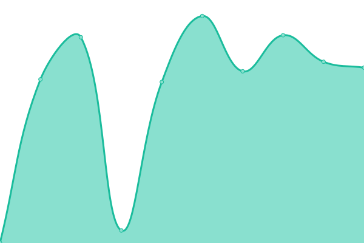

# [📈 Live Status](https://status.whatthehost.de): <!--live status--> **🟧 Partial outage**

This repository contains the open-source uptime monitor and status page for [Upptime](https://upptime.js.org), powered by [Upptime](https://github.com/upptime/upptime).

With [Upptime](https://upptime.js.org), you can get your own unlimited and free uptime monitor and status page, powered entirely by a GitHub repository. We use [Issues](https://github.com/upptime/upptime/issues) as incident reports, [Actions](https://github.com/WhatTheHost-Dev/Status/actions) as uptime monitors, and [Pages](https://status.whatthehost.de) for the status page.

<!--start: status pages-->
<!-- This summary is generated by Upptime (https://github.com/upptime/upptime) -->
<!-- Do not edit this manually, your changes will be overwritten -->
<!-- prettier-ignore -->
| URL | Status | History | Response Time | Uptime |
| --- | ------ | ------- | ------------- | ------ |
|  [Webseite](https://www.whatthehost.de) | Nicht Erreichbar | [webseite.yml](https://github.com/WhatTheHost-Dev/Status/commits/HEAD/history/webseite.yml) | 

 605ms
     
 | 

<a href="https://status.whatthehost.de/history/webseite">98.94%</a>
    

|  [Dashboard](https://dashboard.whatthehost.de) | Nicht Erreichbar | [dashboard.yml](https://github.com/WhatTheHost-Dev/Status/commits/HEAD/history/dashboard.yml) | 

 1581ms
     
 | 

<a href="https://status.whatthehost.de/history/dashboard">98.95%</a>
    

|  Livechat | Nicht Erreichbar | [livechat.yml](https://github.com/WhatTheHost-Dev/Status/commits/HEAD/history/livechat.yml) | 

 514ms
     
 | 

<a href="https://status.whatthehost.de/history/livechat">98.95%</a>
    

|  [Forum](https://community.whatthehost.de) | Nicht Erreichbar | [forum.yml](https://github.com/WhatTheHost-Dev/Status/commits/HEAD/history/forum.yml) | 

 899ms
     
 | 

<a href="https://status.whatthehost.de/history/forum">98.96%</a>
    

|  Plesk Host 1 | Erreichbar | [plesk-host-1.yml](https://github.com/WhatTheHost-Dev/Status/commits/HEAD/history/plesk-host-1.yml) | 

 956ms
     
 | 

<a href="https://status.whatthehost.de/history/plesk-host-1">98.98%</a>
    

|  Game Panel | Erreichbar | [game-panel.yml](https://github.com/WhatTheHost-Dev/Status/commits/HEAD/history/game-panel.yml) | 

 583ms
     
 | 

<a href="https://status.whatthehost.de/history/game-panel">98.98%</a>
    

|  Game Host 1 | Nicht Erreichbar | [game-host-1.yml](https://github.com/WhatTheHost-Dev/Status/commits/HEAD/history/game-host-1.yml) | 

 114ms
     
 | 

<a href="https://status.whatthehost.de/history/game-host-1">98.98%</a>
    

<!--end: status pages-->

[**Visit our status website →**](https://status.whatthehost.de)

## 📄 License

- Powered by: [Upptime](https://github.com/upptime/upptime)
- Code: [MIT](./LICENSE) © [Upptime](https://upptime.js.org)
- Data in the `./history` directory: [Open Database License](https://opendatacommons.org/licenses/odbl/1-0/)
